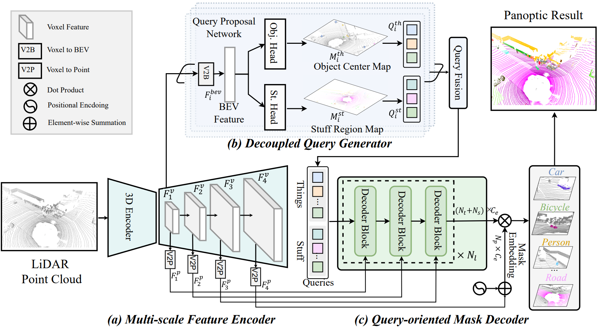

# Introduction 
LiDAR panoptic segmentation (LPS) performs semantic and instance segmentation for *things* (foreground objects) and *stuff* (background elements), essential for scene perception and remote sensing. We presents DQFormer, a novel framework for unified LPS that employs a decoupled query workflow to adapt to the characteristics of things and stuff in outdoor scenes. It first utilizes a feature encoder to extract multi-scale voxel-wise, point-wise, and BEV features. Then, a decoupled query generator proposes informative queries by localizing things/stuff positions and fusing multi-level BEV embeddings. A query-oriented mask decoder uses masked cross-attention to decode segmentation masks, which are combined with query semantics to produce panoptic results. Extensive experiments on large-scale outdoor scenes, including the vehicular datasets nuScenes and SemanticKITTI, as well as the aerial point cloud dataset DALES, show that DQFormer outperforms superior methods by +1.8\%, +0.9\%, and +3.5\% in panoptic quality (PQ), respectively.

<div align="center">
  
</div>

# Get Started

Running the code primarily consists of four steps:
1. [Installation](#installation): Prepare the required environments
2. [Datasets Preparation](#datasets-preparation): Prepare the datasets
3. [Training](#training): Execute the training scripts
4. [Validation](#validation): Run the evaluation scripts

## Installation

Install dependencies (we test on python=3.8.17, pytorch==1.10.0, cuda==11.3, other versions may also work)
```
git clone https://github.com/yuyang-cloud/DQFormer.git
pip install torch==1.10.1+cu113 torchvision==0.11.2+cu113 torchaudio==0.10.1+cu113 -f https://download.pytorch.org/whl/torch_stable.html

# Install requirements
pip install -r requirements.txt

# Install DQFormer package by running in the root directory of this repo
pip install -U -e .
```

Install `sptr`
```
cd dqformer/third_party/SparseTransformer && python setup.py install
```
Note: Make sure you have installed `gcc` and `cuda`, and `nvcc` can work (if you install cuda by conda, it won't provide nvcc and you should install cuda manually.)


Download the pre-trained weights for the backbone and place them in the `DQFormer/ckpts` directory.
* [SemanticKITTI Backbone](https://drive.google.com/file/d/1NHqk3LlNafgLyU5ayZ8VVeGlPb_4GlU4/view?usp=sharing)
* [nuScenes Backbone](https://drive.google.com/file/d/1xp0OFeKnLye0sBJ55Ad6snbeElEM-DaT/view?usp=sharing)

## Datasets Preparation

### SemanticKITTI
Download the SemanticKIITI dataset from [here](http://www.semantic-kitti.org/dataset.html#download). Unzip and arrange it as follows:
```
DQFormer/
└── dqformer/
    └── data/
        └── kitti
            └── sequences
                ├── 00/           
                │   ├── velodyne/	
                |   |	├── 000000.bin
                |   |	├── 000001.bin
                |   |	└── ...
                │   └── labels/ 
                |       ├── 000000.label
                |       ├── 000001.label
                |       └── ...
                ├── 08/ # for validation
                ├── 11/ # 11-21 for testing
                └── 21/
                    └── ...
```

### nuScenes
Download the nuScenes dataset from [here](https://www.nuscenes.org/nuscenes#download), which include the `Full dataset`, the `nuScenes-lidarseg` dataset and the `nuScenes-panoptic` dataset. Arrange the downloaded data folder structure as follows:
```
nuscene
├── lidarseg
├── maps
├── panoptic
├── samples
├── sweeps
├── v1.0-mini
├── v1.0-test
└── v1.0-trainval
```
Then, use [nuscenes2kitti](https://github.com/yuyang-cloud/DQFormer/blob/main/dqformer/utils/nuscenes2kitti.py) script to conver the nuScenes format into the SemanticKITTI format:
```
python dqformer/utils/nuscenes2kitti.py --nuscenes_dir <nuscenes_directory> --output_dir <output_directory>
```
This will create a directory for each scene in `<output_directory>`, maintaining the same structure as SemanticKITTI. To establish a symbolic link between `dqformer/data/nuscenes` and `<output_directory>`, follow these steps:
```
ln -s <output_directory> DQFormer/dqformer/data/nuscenes

DQFormer/
└── dqformer/
    └── data/
        └── nuscenes
            ├── 0001/           
            │   ├── velodyne/	
            |   |	├── 000000.bin
            |   |	├── 000001.bin
            |   |	└── ...
            │   ├── labels/ 
            |   |	├── 000000.label
            |   |   ├── 000001.label
            |   |   └── ...
            │   ├── calib.txt
            │   ├── files_mapping.txt
            │   ├── lidar_tokens.txt
            │   └── poses.txt
            ├── .../
            └── 1110/
```

## Training

```
cd DQFormer/dqformer
CUDA_VISIBLE_DEVICES=[GPU_IDs] python scripts/train_model.py
```
Set `GPU_IDs` to specify the GPUs to be used for training. The program will run in parallel across multiple GPUs.

## Validation
```
cd DQFormer/dqformer
CUDA_VISIBLE_DEVICES=[GPU_IDs] python scripts/evaluate_model.py --w [path_to_model]
```
Set `GPU_IDs` to specify the GPUs for evaluation. The program will be evaluated in parallel across multiple GPUs. Please note that using only one GPU will report per-class performances.

## Acknowledgement
This repo benefits from [SphereFormer](https://github.com/dvlab-research/SphereFormer), [CenterFormer](https://github.com/TuSimple/centerformer) and [MaskPLS](https://github.com/PRBonn/MaskPLS).

## License
This project is released under the MIT License as found in the [LICENSE](https://github.com/yuyang-cloud/DQFormer/blob/main/LICENSE) file.